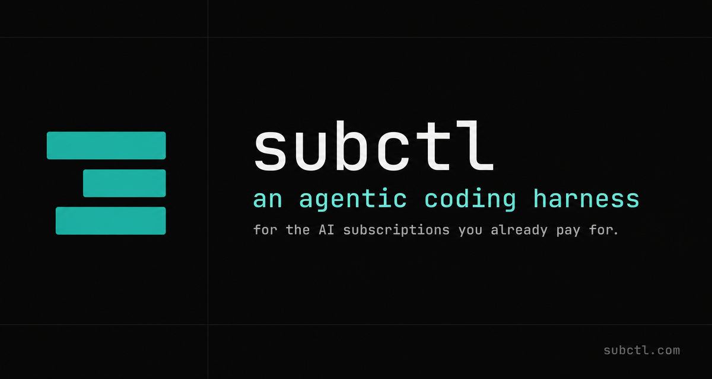

<p align="center">
  
</p>

# subctl

**An agentic harness for the AI subscriptions you already pay for.**

A persistent conversational orchestrator that runs on your hardware, talks to you through a dashboard chat panel or Telegram, spawns dev-team tmux sessions on demand, watches them for staleness, gates its own claims with a runtime verifier, and pushes projects forward — with your laptop closed and your subscriptions on auto-rotate.

```
                                     ┌─────────────────────────┐
                                     │  subctl master          │
   you ─────────────┐                │  (persistent daemon)    │
                    │                │                         │
   dashboard chat ──┼──────────────► │   • SKILL + tier-1 mem  │
   Telegram     ────┘                │   • 50+ tools           │
                                     │   • Verifier + watchdog │
                                     │   • Personality presets │
                                     │   • Scheduler           │
                                     └─────────┬───────────────┘
                                               │  spawn / msg / kill
                                               ▼
                                     ┌─────────────────────────┐
                                     │  dev teams (tmux)       │
                                     │   • Claude Code workers │
                                     │   • per-account isolate │
                                     │   • own SKILL + tools   │
                                     └─────────────────────────┘
```

> **v2.8.12 shipping.** Full per-release history in [CHANGELOG.md](./CHANGELOG.md). The 1.x series was the multi-account dispatch substrate; the 2.x series is the agentic harness layered on top. v2.7 closed the loop on persona, supervisor profiles, HMAC trust markers, dynamic provider catalog, voice, and plan-approval. v2.8 added the memory substrate, the SPEC-block directive contract, the policy engine modes, the MCP control plane, and the watchdog classifier that ended the false-unresponsive alerts.

> 🚀 **First time on a new Mac?** Open a fresh Claude Code session and paste [`START-HERE.md`](./START-HERE.md). It walks you clone → install → account auth → master daemon enable, asking before any irreversible step.

---

## What you actually get

- **Conversational dev-team orchestrator** — talk to `subctl master` in the dashboard chat or Telegram. It spawns Claude Code workers in tmux sessions on the right accounts, watches them for staleness, nudges or escalates as needed. Responses route back to whichever channel you used.

- **Multi-account dispatch** — run multiple Claude accounts + an OpenAI Codex OAuth account on one machine without log-out/log-in dances. The dispatcher picks the healthiest account (lowest rate-limit pressure) at spawn time.

- **Tiered memory substrate:**
  - **Tier 1 — profile:** `user.md` + `memory.md` always injected into the master's system prompt (~3500 char budget — fast, durable, operator-editable)
  - **Tier 2 — observation:** [claude-mem](https://github.com/thedotmack/claude-mem) semantic search over every dev-team observation
  - **Tier 3 — curated:** auto-curated durable facts (bun:sqlite + FTS5 / Evy Memory) promoted from raw conversation by a background consciousness loop; surfaced into the master's turn context on demand
  - **Tier 4 — graph + lexical store:** [Cognee](https://github.com/topoteretes/cognee) (primary, v2.8.7+) for cross-session semantic recall with graph context; `memory_search` / `memory_timeline` route here with claude-mem as fallback
  - **Tier 5 — vault:** Obsidian vault for long-form decisions, specs, RESUME files — browse in-page via the built-in viewer with `[[wikilinks]]`, embeds, callouts, and tag rendering

- **Runtime claim verifier (Argent-style)** — after every assistant turn the runtime scans for "claim triggers" (specific future check-in times, asserted team statuses, host facts, sent-message claims, decision-logged claims). Any claim not backed by a tool call this turn fires a synthetic `[verifier]` correction prompt. Capped at 2 corrections; on giveup the gap lands in `decisions.jsonl` so you can grep chronic offenders.

- **Self-scheduling** — when the master says "I'll check in 15 minutes" it MUST call `schedule_followup` first or the verifier catches the unbacked promise. The followup record survives daemon restarts.

- **Multi-team camera view** — NVR-style grid of every active dev-team tmux pane in the Orchestration tab, polling at 2 Hz. Click a tile to expand to full pane.

- **Document attachments in chat** — drag-drop a file, click the paperclip, or paste >4 KB to auto-attach. The chat surface stays readable (pill chips) while the model sees full inline content. After auto-compaction the master can re-read via the `read_attachment` tool.

- **Personality presets** — hot-swap the master's voice (`straight-shooter`, `witty`, `sarcastic`, `robotic`, `arnold-inspired`, `elon-inspired`, `hilarious`) without touching its persona contract. CLI + dashboard tile.

- **Watchdog + auto-compact** — master ticks every 3 min; if any team has gone silent past the staleness threshold (15 min default), the classifier inspects the worker's last reply (`working` / `completed_idle` / `awaiting_input` / `blocked`) and only synthesizes a corrective prompt when the worker is genuinely stuck. Auto-compact runs every 5 min, compacting transcript history when it crosses 90 % of the supervisor's loaded context window.

- **MCP server (built in)** — master exposes a per-session, multi-client streamable-HTTP MCP endpoint at `/mcp` with 14 tools across talk-to-master, state-read, team-supervision, and memory-recall tiers. Drop the URL into Claude Desktop / Claude Code / ArgentOS and you've got a control plane for the master from any MCP client. Token minted at install; multiple clients coexist on the same daemon.

- **Voice layer** — opt-in self-hosted TTS sidecar. Master can speak alerts and replies through Telegram voice notes or the dashboard 🔊 button. Redacted by default (no secrets vocalized).

- **Plan-approval workflow** — workers that emit `plan_approval_request` surface to the operator as a high-severity notification on both the dashboard tray and Telegram. Approve or reject from either surface; the master forwards the decision back to the worker over the HMAC-authenticated `/msg` route.

- **Policy engine — Trusted / Gated / Sealed** — every worker spawn inherits a policy mode; Gated is the default. Documented in detail under [Defaults](#defaults) below.

- **HMAC-authenticated directives + SPEC contract** — every dashboard/master-to-worker directive carries an HMAC signature AND an embedded `SPEC:` block. Workers refuse unsigned markers (proves WHO) AND refuse markers without an embedded spec body (proves WHAT). End of "paste-then-start" delivery race.

- **OpenAI Codex OAuth + dynamic provider catalog** — `subctl auth openai-codex <alias>` mints fresh OAuth tokens via in-process device-code flow. The dashboard's model picker is now a live catalog (~30+ providers) fed from the upstream pi-ai registry — new providers light up automatically without a release.

- **Dashboard** — live ops view at `http://<host>:8787` with 13 sidebar tabs (Chat, Orchestration, Dashboard, Projects, Teams, Claude Sessions, Models, Providers, Memory, Vault, Skills, Live Logs, Settings). Frontend decomposed into ES modules; lazy-loaded heavy tools (terminal, update modal, vault editor) keep the initial load light.

- **Multi-channel I/O** — dashboard chat (SSE), Telegram (bidirectional with auto-relay + voice notes), CLI prompt, scheduled self-prompts, inbox events from workers, MCP clients.

---

## Defaults

[#defaults](#defaults)

Subctl spawns workers in **Gated** mode by default. Every other harness defaults to **Trusted**.

This is the single difference that matters most.

Every coding agent CLI in the field today — Claude Code, Codex, PI, OpenCode, Cursor, Cline — ships with the bash tool effectively trusted. The model decides whether a command is safe. As model capability scales, that trust model breaks: agents persistent enough to recover from "command not allowed" by writing inline code, by writing a custom npm script, by piping curl into sh. We have already seen this fail mode in production.

Subctl is positioned to fix it because subctl is the **spawn point** for every worker it launches. The master daemon already controls the per-account isolated config directory, the tmux session, and the working directory. Adding a policy layer there means every spawned worker inherits the policy automatically — no per-project hook setup, no per-CLI configuration.

### The three modes

| Mode | Trust gate | When |
|------|-----------|------|
| **Trusted** | The model itself | Throwaway sandboxes. Opt-in. Subctl warns at spawn. |
| **Gated** | Policy allowlist (subctl-managed) | **Default.** All real work. |
| **Sealed** | No shell at all; explicit tools only | Production-adjacent. Long-running unattended tasks. |

Mode is chosen at spawn time:

```bash
subctl teams claude                          # Gated (default), preset auto-detected
subctl teams claude --mode=sealed            # No shell. Explicit tools only.
subctl teams claude --mode=trusted           # Raw. Warning printed.
```

Per-project policy lives in `<project>/.subctl/policy.toml`. Shipped presets cover Node, Python, and a restrictive generic baseline. See `docs/policy.md` for the full schema.

### What Gated mode prevents

- `rm -rf` and its variants, including indirect forms
- `curl ... | sh` and `wget ... | sh` drive-by execution
- `python -c '...'` and `node -e '...'` inline code execution (the universal escape hatch — denied across every interpreter)
- `npm run <undeclared-script>` (closes the package.json-rewrite attack)
- Writing to shell init files (`.bashrc`, `.zshrc`, etc.)
- Fork bombs, `dd` to block devices, `chmod -R 777`, `chown -R`

### What Gated mode does *not* prevent

- A worker overwriting a file with bad content (reversible via git, which is why we accept it)
- A worker doing legitimate damage with a legitimate command (no allowlist can fix this)
- Prompt injection that convinces the master to spawn a worker in Trusted mode (separate concern — see roadmap)

### Audit

Every check writes a line to `~/.local/state/subctl/audit/<team>.jsonl`. The dashboard's Live Logs tab has a Policy filter. Denials are surfaced in real time. The master's runtime verifier watches for denial clusters and steers the worker away from fighting the gate.

### Override per team

```bash
# Opt out for a specific spawn
subctl teams claude --mode=trusted

# Or persist the default in user config:
echo 'default_mode = "trusted"' >> ~/.config/subctl/config.toml

# Or persist per project:
cat > ~/code/sandbox/.subctl/policy.toml <<EOF
preset = "node"
default_mode = "trusted"
EOF
```

### Full reference

[`docs/policy.md`](docs/policy.md) — schema, presets, escape hatches, threat model.

---

## Install

```bash
git clone https://github.com/webdevtodayjason/subctl.git
cd subctl

# 1. See what's missing without touching anything (recommended first step)
bash install.sh --check-only

# 2. Run the full installer (preflight → install → verify → wire)
bash install.sh
```

The installer reads its full dep matrix from `lib/dep-manifest.json` (the single source of truth shared with `subctl doctor`, `subctl setup --check`, and the dashboard's Settings → Install Checks panel — edit one file, all four stay in sync).

**Three phases:**

1. **Preflight** — prints a status table of every hard + soft dep. No side effects.
2. **Install** — topologically ordered: Homebrew (auto-bootstrap if missing) → brew packages (jq, tmux, gh, gum, go, node) → bun (curl installer with `BUN_INSTALL_NO_PROFILE=1`) → claude CLI → codex → coderabbit → docker (cask, confirm) → claude-mem (npx) → Telegram bot walkthrough. Every step is confirm-gated unless `--yes` is passed.
3. **Verify** — re-runs preflight, prints a final go/no-go table, then wires the Claude statusline + Stop hook + skills + MCP server + both launchd plists (`com.subctl.master` and `com.subctl.dashboard`) + seeded operator configs (cognition loop enabled, idle-pane watchdog in notify-only, MCP token minted into `secrets.json`). Existing operator configs are never overwritten — the seed only fills in missing files.

**Auto vs. manual vs. detect-only:**

| Dep | How |
|-----|-----|
| Homebrew, jq, git, tmux, gh, node, gum, go | Auto via `brew install` |
| bun | Auto via `curl https://bun.sh/install` (with `BUN_INSTALL_NO_PROFILE=1`) |
| claude | Auto via `curl https://claude.ai/install.sh` |
| codex | Auto via `npm i -g @openai/codex` |
| coderabbit | Auto via `curl https://cli.coderabbit.ai/install.sh` |
| Docker Desktop | Auto via `brew install --cask docker` (confirm) — open the app once after install for system-extension prompts |
| claude-mem (Claude Code plugin) | Auto via `npx --yes claude-mem install` |
| **LM Studio**, **Obsidian**, **Context7 key** | Detect-only — manual install link printed, never auto-installed |
| **Telegram bot** | Walkthrough — see below |

**LM Studio default model.** After LM Studio + `lms` are both detected, the installer offers to pull `qwen/qwen3.6-35b-a3b` (~20 GB) via `lms get …` with a Y/n confirm. Default is yes — `subctl master` can't supervise without a model loaded.

**BotFather walkthrough.** `subctl master enable` hard-aborts if `~/.config/subctl/master-notify.json` is missing. The installer offers an interactive walkthrough for the @BotFather → token → chat_id → write config dance. Run it standalone any time:

```bash
bash install.sh --botfather       # or: subctl setup --botfather
```

**Useful flags:**

```bash
bash install.sh --check-only          # preflight + verify; NO installs
bash install.sh --skip-deps           # jump to component wiring
bash install.sh --yes                 # non-interactive; assume yes everywhere
bash install.sh --allow-missing-hard  # don't abort on missing hard deps
bash install.sh --botfather           # JUST the Telegram walkthrough
bash install.sh --dry-run             # show what would happen
```

**Idempotent.** Re-running on a fully-installed machine prints the ✓ table and skips the install phase entirely.

**Install tree vs. dev tree.** Fresh installs create a separate git worktree at `~/.local/lib/subctl-install`, pinned to `main`, and the launchd dashboard plist points at THAT tree — not at your clone in `~/code/subctl` (or wherever you ran `bash install.sh` from). This means feature-branch checkouts in your dev tree don't silently change what the daily-driver dashboard serves on next restart. Override the install-tree location with `SUBCTL_INSTALL_TREE=/some/path bash install.sh`. To roll a new `main` into the running dashboard:

```bash
cd ~/.local/lib/subctl-install && git pull origin main
launchctl kickstart -k gui/$UID/com.subctl.dashboard
# (or `subctl dashboard deploy` once that CLI verb lands)
```

Add accounts to `~/.config/subctl/accounts.conf` then run `subctl install` again — per-account isolation model is documented in [`docs/multi-account.md`](docs/multi-account.md).

---

## Daily ops

```bash
# Bring up the master + dashboard (launchd; auto-start at login)
subctl master enable
subctl install                            # also installs dashboard service

# Talk to master from the CLI
subctl master prompt "spec the foothold-v3 polish and spawn a team for it"

# Or just open the dashboard
open http://127.0.0.1:8787

# Spawn a dev team directly (bypass master)
subctl teams claude -a claude-jason -c ~/code/myproject -o -y

# Switch master's voice
subctl master personality set sarcastic

# Bounce the daemon if it got wedged
subctl master restart
subctl master kick                        # recover from launchd throttle (local TTY only)

# Pull latest + restart services
subctl update

# Status
subctl status                              # global verdict + accounts table
subctl doctor                              # tools + credentials + paths
subctl master status                       # daemon health + tools loaded + supervisor
subctl orch list                           # running dev-team tmux sessions
```

Full CLI surface: `subctl help`. Cheat sheet at `http://<host>:8787/cheat`. Full reference at `http://<host>:8787/help`.

---

## Architecture

The canonical architecture document is [`docs/master.md`](docs/master.md):

- §1 Mental model — master as a conversational dev-team orchestrator
- §2 Components & file layout — daemon, dashboard, skills, templates, inbox
- §3 Memory architecture — the tiered substrate
- §4 Roadmap — every shipped phase + what's queued
- §5 Operational reference — restart cookbook, LM Studio config, accounts
- §6 Glossary
- §7 Decision log

Provider plugin model (how new AI subscriptions get wired in): [`docs/adding-a-provider.md`](docs/adding-a-provider.md).
Release / bump policy: [`docs/release-workflow.md`](docs/release-workflow.md).

---

## Repo layout

```
.
├── bin/subctl                     CLI entry point
├── components/master/             master daemon (Bun + pi-agent-core)
│   ├── server.ts                  HTTP, SSE, ticker scaffolding
│   ├── tools/                     50+ tools across 13 families
│   ├── personalities/             voice presets
│   ├── verifier.ts                runtime claim verifier
│   ├── attachments.ts             chat attachment storage
│   └── personality.ts             preset loader
├── components/skills/             baseline + master skills
│   ├── master/SKILL.md            master's own system prompt
│   ├── subctl/SKILL.md            worker-facing subctl skill
│   ├── autonomy/SKILL.md          worker autonomy doctrine
│   └── orchestrator-mode/SKILL.md anti-deadlock activation guard
├── dashboard/                     web UI (Bun static + SSE proxy; no build step)
│   ├── server.ts                  HTTP + WS + SSE + auto-proxy /api/master/*
│   ├── public/                    HTML/CSS/JS
│   └── help.md                    /help page source
├── providers/claude/              Claude Code provider (auth, teams, hooks, skills)
├── providers/openai/              OpenAI Codex provider (OAuth + device-auth)
├── lib/                           shell helpers (accounts, install, update,
│                                   master, plugins, settings, …)
├── docs/                          design docs (master.md, multi-account.md,
│                                   release-workflow.md, foothold links)
└── VERSION                        single source of truth for version
```

---

## Roadmap

Per-phase status lives in [`docs/master.md`](docs/master.md) §4. Headline (shipped):

- **Phase 3a–3j** (v2.0.0) — master daemon, 13 tool families, baseline memory, dashboard, verifier, auto-compact
- **Phase 3k** (v2.2.0) — personality presets
- **Phase 3l** (v2.4.0) — document attachments in chat
- **Phase 3m** (v2.3.0) — multi-team camera view
- **Phase 3n** (v2.5.0) — in-browser Obsidian vault viewer
- **Phase 3o** (v2.7.x) — supervisor profiles, watchdog kill controls, HMAC trust marker, web terminal escape hatch, notification channel, dynamic provider catalog, OpenRouter + OpenAI Codex OAuth, voice layer, plan-approval workflow
- **Phase 3p** (v2.8.x) — tiered memory substrate with autonomous consciousness loop, MCP control plane (14 tools), SPEC-block directive contract, watchdog reply classifier (`completed_idle`), seeded operator-config install, policy engine (Trusted/Gated/Sealed) modes

Provider expansion (Phase 4+): Gemini, Z.AI GLM, Minimax — see [`ROADMAP.md`](./ROADMAP.md).

---

## Contributing

PRs welcome. To add a new provider, read [`docs/adding-a-provider.md`](docs/adding-a-provider.md). For master daemon changes, read [`docs/master.md`](docs/master.md) first — it has 3+ months of decision history baked in. For everything else, open an issue first so we can agree on shape.

Bump policy in [`docs/release-workflow.md`](docs/release-workflow.md): patch (Z) is the default; minor (Y) only for genuine new user-visible features; major (X) only for breaking changes. Single source of truth for the version is [`VERSION`](./VERSION).

## License

MIT — see [LICENSE](LICENSE).
